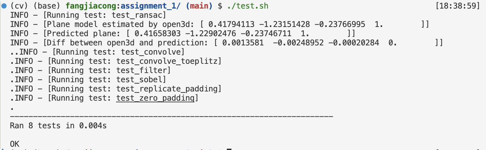

## 实现
按照文档要求依次实现, 其中`canny/non_maximal_suppressor` 实现了双线性插值的方法.  

---

## 测试
### 简要介绍
基于一些已有的python库和`unittest`库，实现了一个简单的测试框架。
- `./test_convolve.py`：卷积测试用例, 与 `numpy.pad` 及 `scipy.signal.convolve2d` 的结果进行对比, 要求结果一致.
- `./test_RANSAC.py`：RANSAC 测试用例, 使用 `open3d` 来得到拟合平面的参数, 通过读取保存的 `result/HM1_RANSAC_plane.txt` 进行对比, 设置的阈值为 `1e-2`.
- canny 和 corner detector 的测试用例未实现, 个人感觉直接观察结果即可.

### 使用方法
将 `test/` 和 `test.sh` 置于作业一的根目录下, 运行脚本 `test.sh` 即可, 观察到 `OK` 即为通过测试. 

## Good Luck! 